# Food Delivery Operations & Delivery Performance Analytics

## 1. Project Overview

This repository documents a completed descriptive and diagnostic analytics project for food delivery operations and delivery performance. The project uses an existing dataset and applies a fixed set of analytical rules and definitions to assess observed delivery-time patterns and operational concentrations in the available data.

The focus is on understanding where slow-delivery burden is concentrated across operational conditions and which observed segments warrant further investigation. This phase is intentionally descriptive and diagnostic rather than predictive modeling. It is designed to summarize patterns in the cleaned data without making causal claims or presenting a deployment-ready operational system.

## 2. Business Objective

The primary analytical objective was to understand overall delivery performance, identify where slow deliveries are concentrated, and examine the observed behavior of key operational dimensions, including traffic, workload, city, order time, distance, weather, vehicle type, and vehicle condition.

The analysis also investigated the most important cross-factor combinations to determine where the slow-delivery burden is most visible in context. The goal was to produce evidence-based operational observations that can support future investigation, rather than to claim a proven cause or prescribe permanent policy changes.

## 3. Analytical Questions / Parameters

The project addressed the following analytical dimensions and comparisons:

- Overall delivery performance
- Traffic
- Multiple deliveries
- City
- Order time
- Distance
- Weather
- Vehicle type
- Vehicle condition
- Traffic × Multiple Deliveries
- City × Traffic
- Distance × Traffic
- Weather × Traffic
- Vehicle × Multiple Deliveries
- Time × Traffic

Shared analytical rules applied throughout the project:

- A valid delivery record requires a valid numeric `Time_taken(min)` target.
- The fixed slow-delivery threshold is `Time_taken(min) > 40` minutes.
- A minimum of 30 valid records is the reporting guardrail for comparative interpretation.
- Results are observational and descriptive; they do not establish causation.
- Missing values are excluded only from the relevant grouped comparison and are reported where material.

## 4. Dataset & Source

This project uses the existing cleaned training dataset and the associated processed data assets in the repository:

- Raw data: [data/raw/](data/raw/)
- Cleaned data: [data/processed/](data/processed/)
- Training cleaned dataset: [data/processed/train_clean.csv](data/processed/train_clean.csv)
- Test cleaned dataset: [data/processed/test_clean.csv](data/processed/test_clean.csv)

The performance analysis uses the cleaned training data because it contains the observed delivery-time target needed for descriptive performance calculations. The test dataset is retained as a dataset artifact for checks that do not require an observed target value; it is not treated as a source of observed delivery-time performance in this descriptive phase.

### Dataset Source

The dataset used in this project was obtained from the publicly available Food Delivery Dataset hosted on Kaggle.

Source: [Kaggle — Food Delivery Dataset](https://www.kaggle.com/datasets/gauravmalik26/food-delivery-dataset)

The dataset was used as the source data for the descriptive and diagnostic analysis presented in this repository. The project applies its own documented profiling, data-quality assessment, cleaning, analytical parameters, validation, visualization, and interpretation workflow to the source data.

## 5. Methodology / Workflow

The project followed this workflow:

Raw dataset
→ Profiling
→ Data quality assessment
→ Cleaning
→ SQL analysis
→ Python validation
→ Cross-factor analysis
→ Visualization
→ Findings
→ Business report

This workflow is reflected in the project files under [python/](python/), [sql/](sql/), [outputs/](outputs/), [analysis/](analysis/), and [reports/](reports/).

AI-assisted workflow note: Requirements and analytical scope were defined first. AI tools were then used to assist with implementation, scripting, debugging, validation support, visualization generation, and documentation support. The generated work was executed and reviewed against the analytical requirements before being accepted. AI was used as a development and analysis assistant, not as an autonomous decision-maker.

## 6. Technology Stack

Technology and tools used in the project:

- SQL
- Python
- Pandas
- Matplotlib
- SQLite / database-layer support for SQL-based validation and aggregation
- Git
- GitHub
- VS Code
- AI-assisted development tools

## 7. Project Structure

```text
Food-Delivery-Operations-Analytics/
├── data/
│   ├── processed/
│   └── raw/
├── python/
├── sql/
├── outputs/
│   ├── charts/
│   └── *.md
├── analysis/
├── reports/
├── .gitignore
└── README.md
```

The repository is organized by analytical stage:

- [data/](data/) contains the raw and cleaned datasets.
- [python/](python/) contains profiling, quality checks, cleaning, validation, and visualization scripts.
- [sql/](sql/) contains the standalone and cross-factor SQL analyses.
- [outputs/](outputs/) contains validation notes, analysis summaries, and generated visualizations.
- [analysis/](analysis/) contains the analytical framework and consolidated findings.
- [reports/](reports/) contains the final business-facing report.
- [.gitignore](.gitignore) excludes generated Python environment and editor cache artifacts.

## 8. Key Findings

The strongest validated findings are summarized below using the project’s documented descriptive language and denominators.

- Overall performance: 45,593 valid training records, with 4,037 slow deliveries under the fixed rule `Time_taken(min) > 40`, equal to 8.8544% of the valid-target population.
- Traffic: Jam traffic had a slow-delivery rate of 20.0099% (2,830/14,143), compared with 1.3827% in Low traffic (214/15,477).
- Multiple deliveries: category 2 had a slow rate of 45.7431% (908/1,985), while category 3 had 100.0000% (361/361).
- Metropolitan × Jam concentration: the Metropolitan × Jam cell contributed 2,321 of 4,037 slow deliveries, or 57.49% of the observed slow-delivery burden.
- Distance × traffic: in Jam traffic, the 10–15 km band had a slow rate of 27.5273% (1,435/5,213), and the 15+ km band had a slow rate of 28.7329% (1,093/3,804).
- Weather × traffic: Jam under Fog reached 35.4055% (860/2,429) and Jam under Cloudy reached 34.9510% (821/2,349), while Low traffic weather cells remained below 3%.
- Order-time pattern: Evening had the highest observed slow-delivery rate at 13.2294% (2,367/17,892), while Morning had the lowest at 1.3475% (104/7,718).

These are observed patterns in the cleaned dataset and should be interpreted as descriptive operational signals, not causal effects.

## 9. Visualizations

The project created 14 validated visualizations for the completed descriptive workflow. The chart set is located in [outputs/charts/](outputs/charts/).

### Core visualizations

**V01 — Overall delivery-time distribution**

[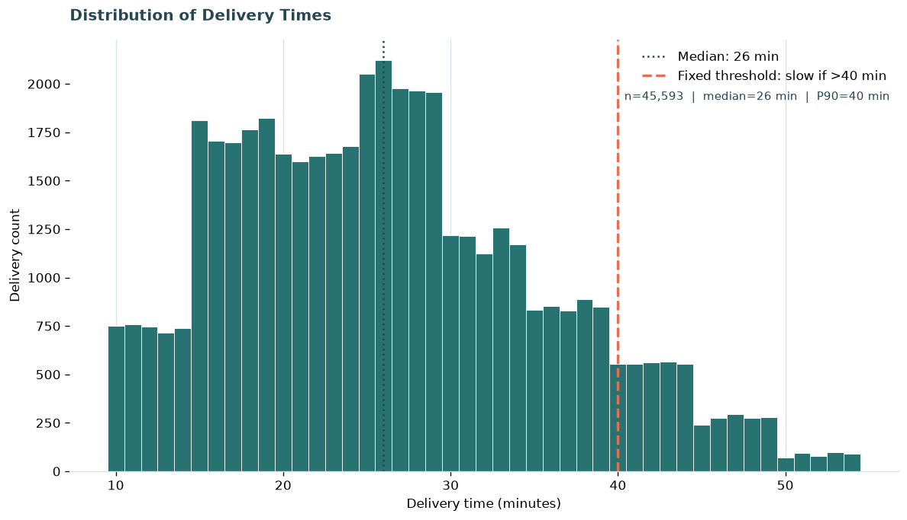](outputs/charts/V01_delivery_time_distribution.png)

**V02 — Traffic performance**

[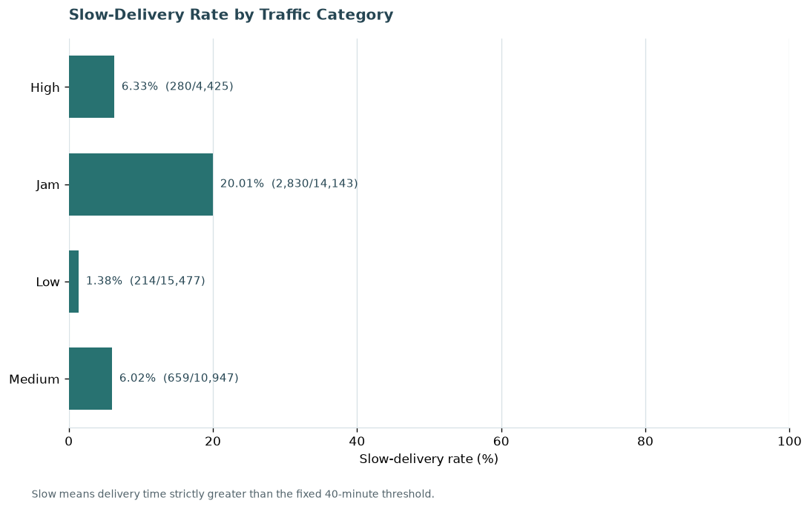](outputs/charts/V02_traffic_performance.png)

**V03 — Multiple-delivery pattern**

[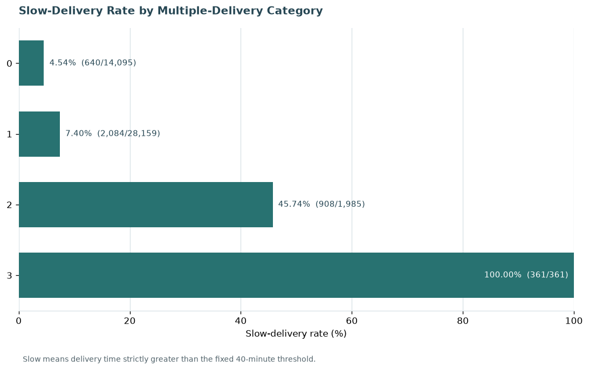](outputs/charts/V03_multiple_deliveries.png)

**V04 — City performance**

[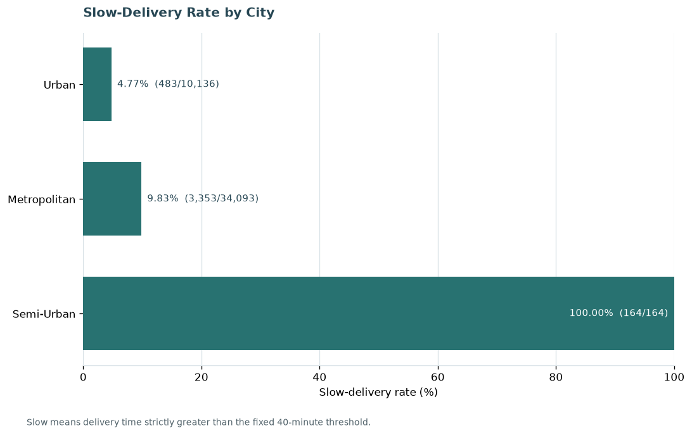](outputs/charts/V04_city_performance.png)

**V05 — Order-time bands**

[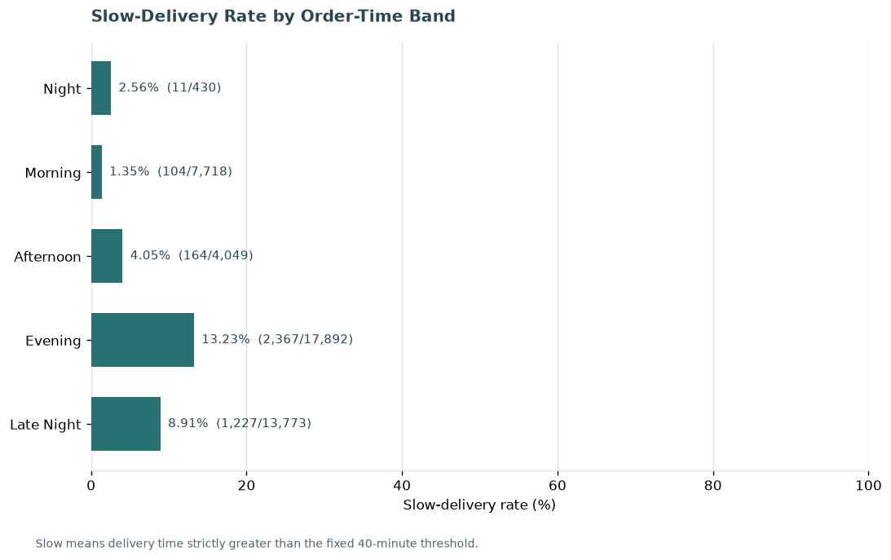](outputs/charts/V05_order_time_bands.png)

**V06 — Distance bands**

[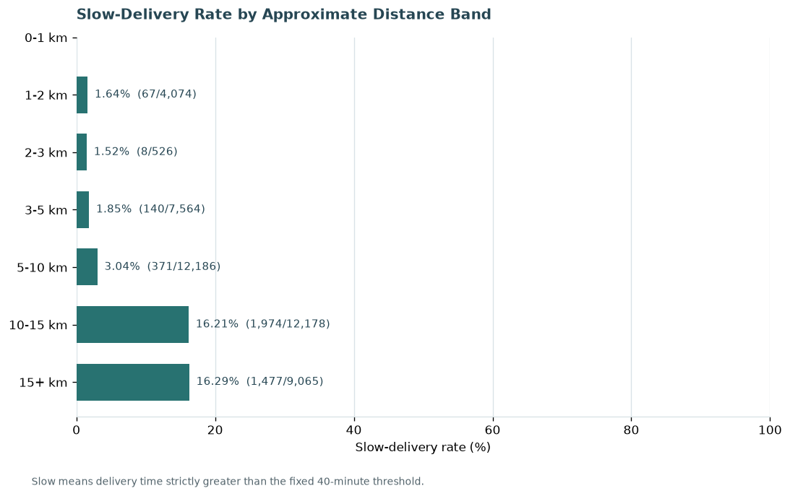](outputs/charts/V06_distance_bands.png)

**V07 — Weather × traffic**

[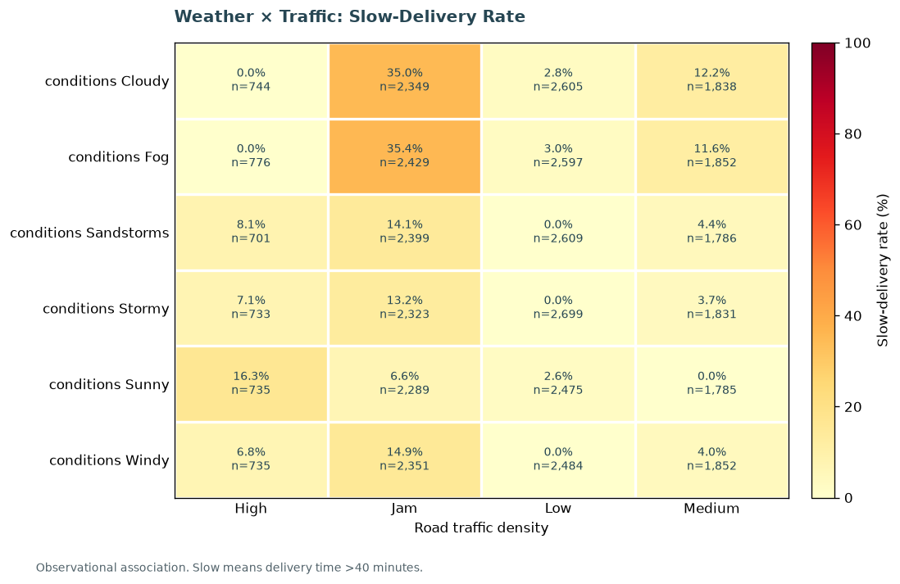](outputs/charts/V07_weather_traffic.png)

**V08 — Distance × traffic**

[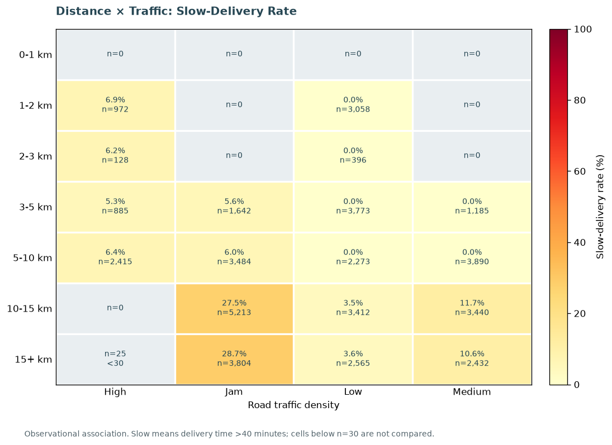](outputs/charts/V08_distance_traffic.png)

### Supporting visualizations

**V09 — Vehicle type**

[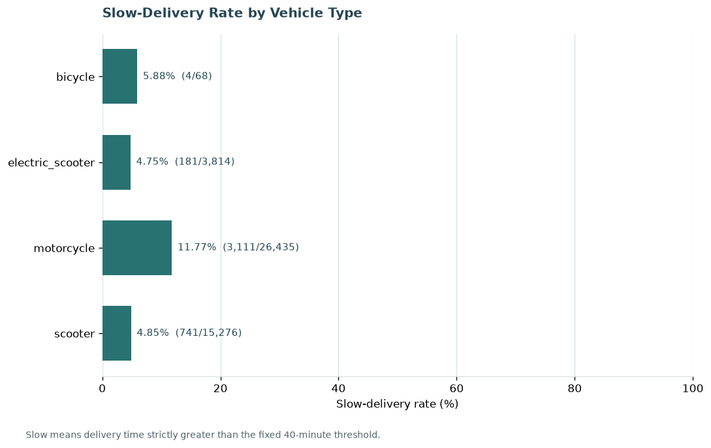](outputs/charts/V09_vehicle_type.png)

**V10 — Vehicle condition**

[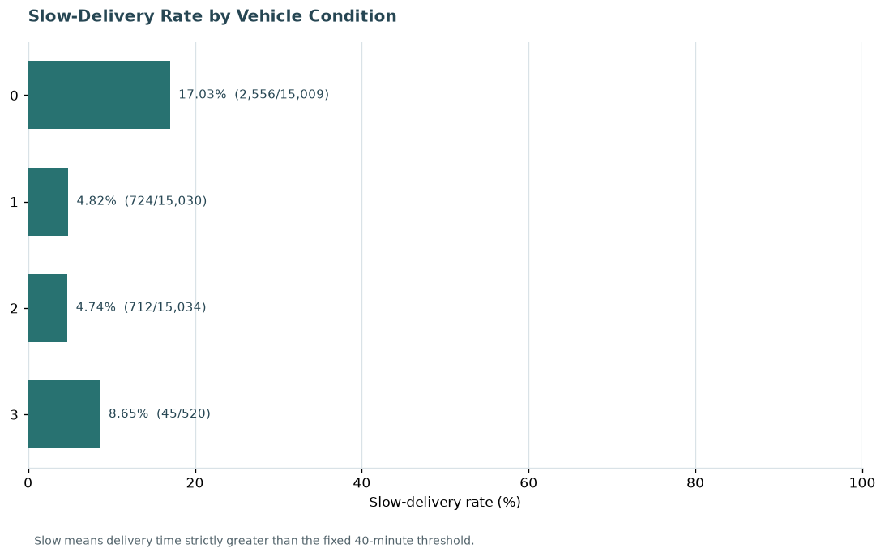](outputs/charts/V10_vehicle_condition.png)

**V11 — City × traffic**

[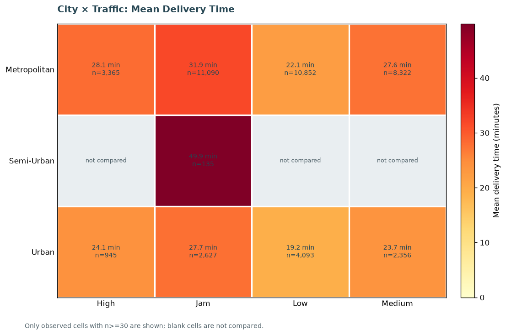](outputs/charts/V11_city_traffic.png)

**V12 — Time × traffic**

[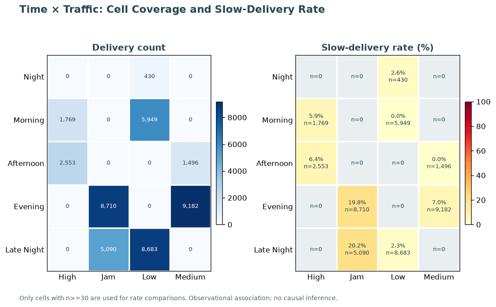](outputs/charts/V12_time_traffic.png)

**V13 — Vehicle × multiple deliveries**

[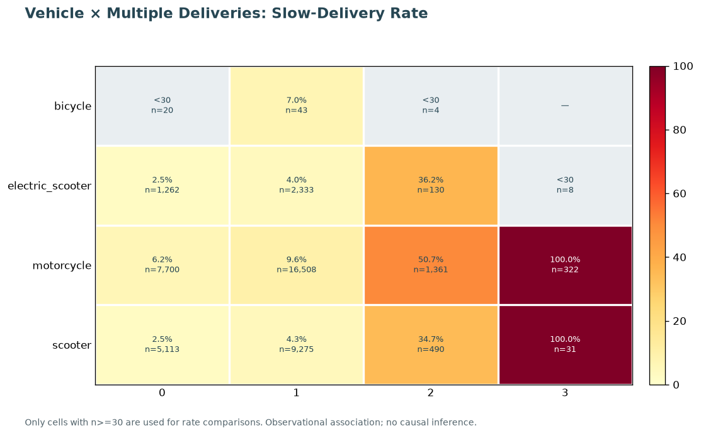](outputs/charts/V13_vehicle_multiple_deliveries.png)

**V14 — Pickup delay bands**

[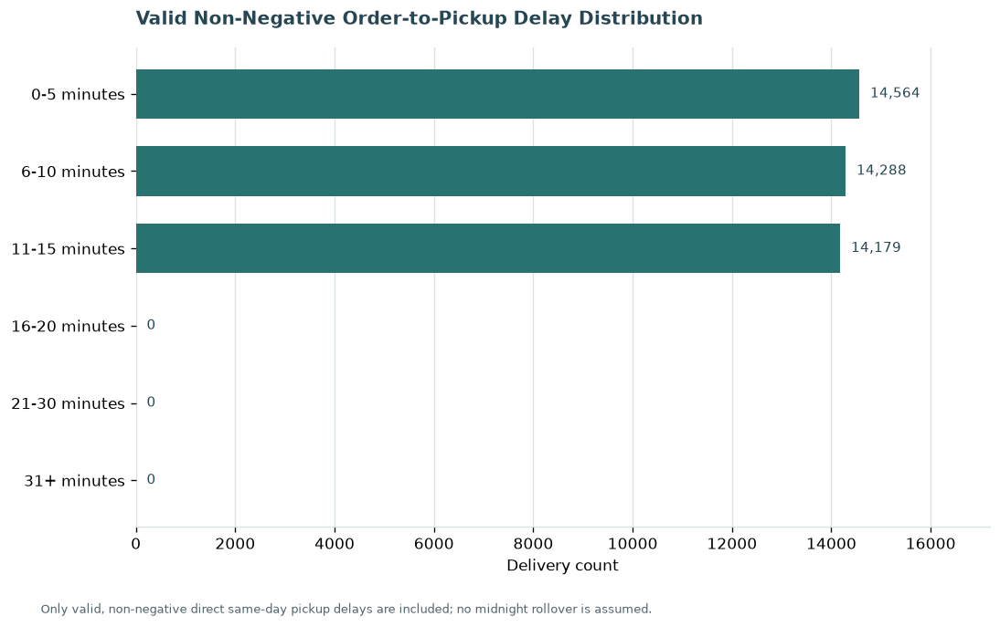](outputs/charts/V14_pickup_delay_bands.png)

## 10. Detailed Analysis & Reports

The repository includes the primary analytical and reporting artifacts:

- [analysis/analytical_framework.md](analysis/analytical_framework.md)
- [analysis/findings.md](analysis/findings.md)
- [reports/final_business_report.md](reports/final_business_report.md)
- [outputs/visualization_specification.md](outputs/visualization_specification.md)
- [outputs/visualization_validation.md](outputs/visualization_validation.md)
- [outputs/overall_delivery_performance.md](outputs/overall_delivery_performance.md)

The individual SQL analysis scripts are in [sql/](sql/), and the Python validation and visualization scripts are in [python/](python/).

## 11. Business Implications

The analysis suggests several operational areas that are worth investigating further, based on observed patterns in the cleaned dataset. These include:

- congested traffic conditions;
- multiple-delivery workload patterns;
- longer-distance deliveries under congestion;
- Metropolitan and high-congestion city/traffic combinations;
- weather × traffic combinations such as Fog and Cloudy conditions under Jam traffic;
- evening and late-night operating windows under congested conditions.

These are preliminary operational implications and hypotheses, not proven causal recommendations.

## What I Learned From This Project

This project helped me move beyond writing individual SQL queries and develop a more complete data-analysis workflow. I learned how to take a real-world public dataset, understand its structure and quality, define analytical questions, and progressively turn the available data into validated business insights.

**Key areas I developed and practiced:**

- **Data Profiling & Quality Assessment** — Examined dataset structure, missing values, inconsistencies, and usable analytical fields before beginning the analysis.
- **Data Cleaning & Preparation** — Worked with the raw dataset to create a consistent analytical version without unnecessarily altering or discarding the underlying information.
- **SQL Analysis** — Applied filtering, aggregation, `GROUP BY`, `HAVING`, joins, subqueries, `CASE`, `EXISTS`, and multi-factor analysis to investigate operational questions.
- **Python & Pandas** — Used Python for data preparation, validation, calculations, and analytical cross-checks.
- **Analytical Validation** — Cross-checked SQL results against Python calculations and validated populations, rankings, and key metrics before accepting findings.
- **Data Visualization** — Converted validated analytical results into charts that make operational patterns easier to interpret.
- **Business Interpretation** — Learned to distinguish an observed pattern from a causal conclusion and communicate findings with appropriate context and limitations.
- **Analytical Documentation** — Structured the project around defined parameters, methodology, findings, limitations, visual evidence, and a final business-oriented report.
- **AI-Assisted Analytical Workflow** — Used modern AI-assisted development tools to accelerate implementation and troubleshooting while retaining responsibility for requirements, validation, interpretation, and final acceptance.

## 12. Limitations

The project’s documented limitations are important for interpretation:

- The analysis is observational and descriptive.
- It does not establish causal relationships.
- No predictive modeling was performed in this phase.
- Some cross-factor cells are sparse or below the 30-record reporting guardrail.
- Missing dimension values are excluded only from the relevant grouped comparison.
- Distance is measured as approximate straight-line geographic distance rather than road or network distance.
- Small-sample or sparse groups are labeled as descriptive context only.
- The 30-record rule is a reporting guardrail, not statistical proof.

## 13. Predictive Analytics — Future Phase

Predictive analytics is not part of this completed descriptive phase.

A future phase may create a modeling-ready dataset from the cleaned data and investigate questions such as predicting delivery time, identifying features with predictive value, classifying slow deliveries, or estimating high-risk delivery combinations. No predictive model results are reported here because none were developed in this completed phase.

## 14. Project Status

- Descriptive Analytics Phase: COMPLETE
- Business Reporting Phase: COMPLETE
- Predictive Analytics Phase: NOT STARTED

## 15. AI-Assisted Development Note

This project followed a human-led analytical workflow. The analytical objectives, parameters, validation requirements, interpretation of results, and final conclusions were defined and reviewed throughout the project.

Modern development and AI-assisted tools were used to accelerate implementation, including SQL/Python development, debugging, data validation, visualization, and documentation. The resulting work was executed, reviewed against the defined requirements, cross-checked across analytical outputs, and refined where necessary before being accepted.

The emphasis throughout the project was on understanding the data, applying the right analytical questions, validating the results, and converting the findings into actionable information. AI was used to improve implementation efficiency; analytical judgment and final decision-making remained human-led.
